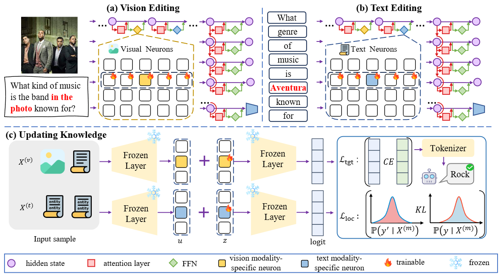

# Correct When Paired, Wrong When Split: Decoupling and Editing Modality-Specific Neurons in MLLMs (ACL 2026)

Tingchao Fu, Wenkai Wang, Fanxiao Li, Huadong Zhang, Jinhong Zhang, Dayang Li, Yunyun Dong, Renyang Liu, Wei Zhou. Correct When Paired, Wrong When Split: Decoupling and Editing Modality-Specific Neurons in MLLMs. The 64th Annual Meeting of the Association for Computational Linguistics, ACL 2026.


## Abstract
Although Knowledge Editing provides an efficient mechanism for updating the knowledge of Multimodal Large Language Models (MLLMs), we find that current paradigms still suffer from an important yet remain underexplored issue: editing decoupling failure, where entity-related knowledge can be updated when the model is triggered by multimodal inputs (text--image query pairs), however, it often reverts to outdated pre-edit facts when the paired inputs are split into unimodal ones. Our in-depth empirical analysis reveals that the entity knowledge in MLLMs is not stored as a unified representation, but is instead distributed across disentangled modality-specific pathways. As a result, updates biased toward multimodal queries fail to propagate effectively to unimodal circuits. To bridge this gap, we propose DECODE, which explicitly disentangles and localizes modality-specific neuron groups for targeted knowledge. Extensive experiments demonstrate that DECODE consistently achieves effective knowledge updates under different modality triggers, thereby mitigating editing decoupling failures.




## Prepare the dataset and model weights

- Datasets download link: https://drive.google.com/file/d/1ieXmgIJsujmVyw3Aqx-gX8Fg-emts0ti/view?usp=drive_link
- LLaVA-v1.5-7B: https://huggingface.co/liuhaotian/llava-v1.5-7b
- InstructBLIP-Vicuna-7B: https://huggingface.co/Salesforce/instructblip-vicuna-7b
- Qwen-VL-7B:https://huggingface.co/Qwen/Qwen-VL

### Requirements

**At least one 40G GPU.** To get started, please clone this repository and install packages as:

```
conda create -n DECODE python=3.12
pip install -r requirements.txt
```


### Run

Analysis and calculation of modality-specific neurons:
```
cd .\editor\llava
python neurons_extract.py
```

After obtaining the modality-specific neurons, edit MLLM:

```
cd .\editor\llava
python edit.py
```

Evaluating the editing performance:

```
cd .\evaluate\llava
python post_evaluation_llava.py
python analyze.py
```

### Acknowledgements

We gratefully acknowledge the use of code and data from the following projects: [FiNE](https://github.com/opanhw/MM_Neurons) and [MMKE-Bench](https://github.com/MMKE-Bench-ICLR/MMKE-Bench).
